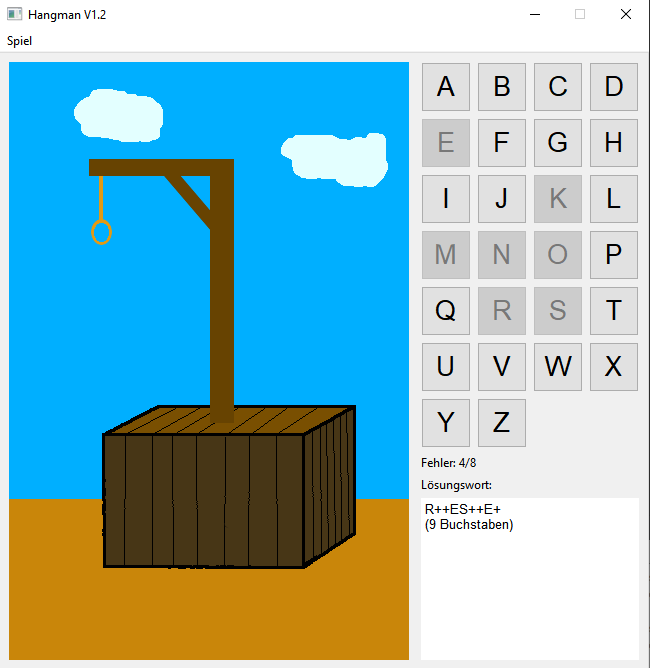
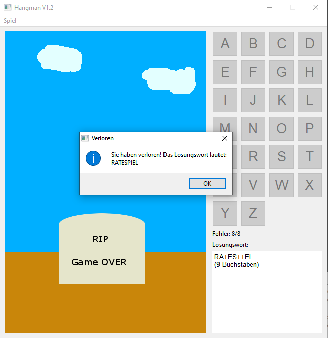

# Hangman

Es wurde das klassische Spiel hangman (Galgenmännchen) als offline multiplayer Spiel programmiert.
Ein Spieler oder eine Spielerin gibt ein Wort ein, das alle anderen Spielenden raten dürfen. Dabei dürfen je nach Schwierigkeitsgrad nur eine bestimmte, maximale Anzahl an Fehlern gemacht werden. Wird das Wort mit weniger Fehlern erraten, haben die ratenden Spielenden gewonnen, ansonsten hat der Spielende gewonnen, der oder die das Wort gewählt hat.

Es gibt folgende Schwierigkeitsgrade:
1. Leicht (maximal 12 Fehler)
2. Mittel (maximal 8 Fehler)
3. Schwer (maximal 4 Fehler)

Die Eingabe erfolgt über die Tastatur oder indem auf die entsprechenden Knöpfe im Programm geklickt wird.

## Installation und Ausführung
Das Programm wurde auf Windows 10 geschrieben und getestet. Zur Installation wird der Ordner Hangman heruntergeladen und auf dem PC gespeichert. Danach kann das Programm mit einem Doppelklick auf Hangman.exe gestartet werden.

Der Quellcode befindet sich im Ordner SourceCode.

## Screenshots

Während des Spiels:

Game Over:

Copyright (C) 2024 Michael